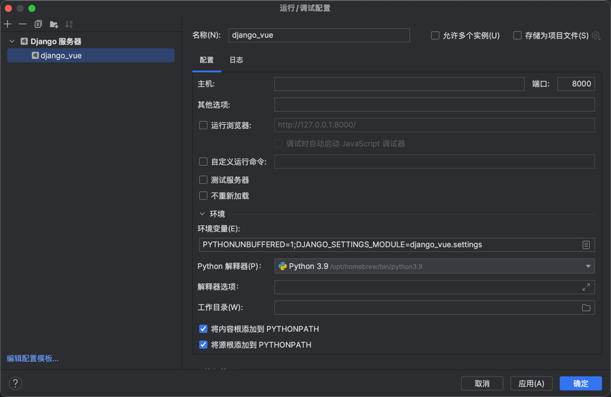

# django + vue 项目demo搭建

## 创建django项目
**创建django项目命令**
```shell
django-admin startproject 项目名称
```
提示：需要提前安装好django
安装命令：
```shell
pip install django
```
如果提示权限不够，可以使用：
```shell
sudo pip install django
```
注意：国内使用官方软件源，可能会出现网络不稳定情况，建议修改仓库源为阿里云源或者清华源：
临时使用
```shell
pip install django -i https://mirrors.aliyun.com/pypi/simple/
```
永久修改配置：
```shell
vim ~/.pip/pip.conf
```
将index-url和trusted-host替换为阿里云地址
```shell
[global]
index-url = https://mirrors.aliyun.com/pypi/simple/

[install]
trusted-host=mirrors.aliyun.com
```

**创建好的项目结构**
```
|-- django_vue
    |-- db.sqlite3
    |-- manage.py
    |-- django_vue
        |   |-- __init__.py
        |   |-- asgi.py
        |   |-- settings.py
        |   |-- urls.py
        |   |-- wsgi.py
```
**运行django项目**
1、通过python命令运行
```shell
#默认是8000端口
python manage.py runserver
#指定IP和端口
python manage.py runserver 127.0.0.1:8000
#指定端口
python manage.py runserver 8000
```
2、通过pycharm运行

## 新增接口
